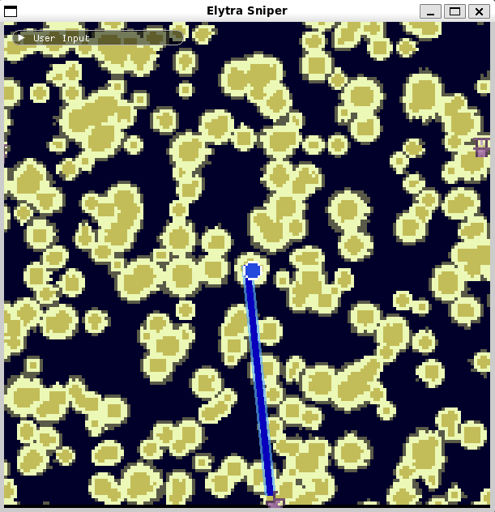
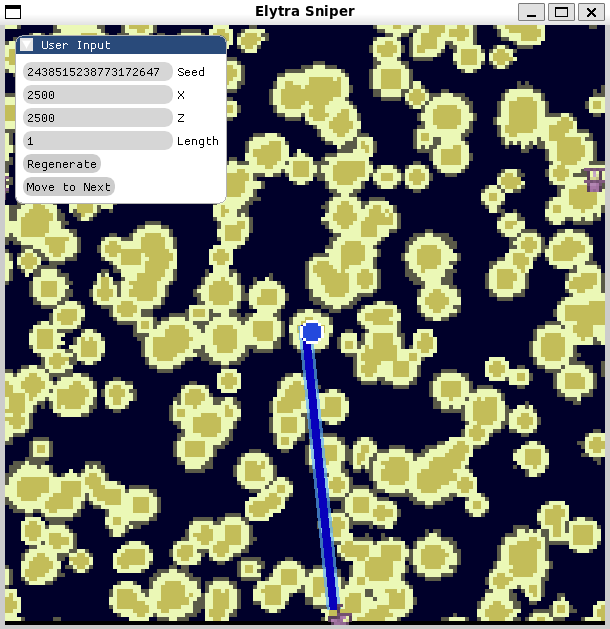
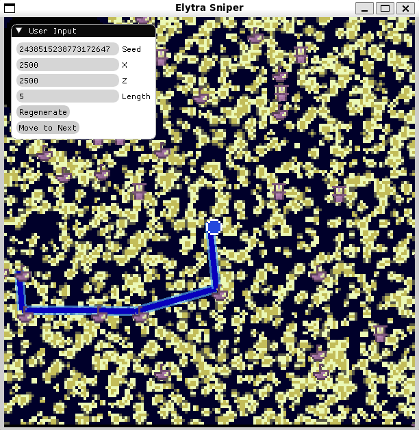

# Elytra-Sniper
Have you ever found yourself in the End dimension with an elytra with the intention of stealing every other elytra on the server? Then this is the only tool for you!

Using our highly performant path search algorthm, ElytraSniper will show you the quickest path to hit as many End Cities as possible.

## Installation Guide
    git clone https://github.com/GoldenRedstone/Elytra-Sniper.git --recursive
    cd ./Elytra-Sniper
    cmake .
    make

## Running Elytra-Sniper
    ./src/ESniper
    
The first time you run ESniper, it will "install" some "dependencies". The next time you run ESniper, the app will be fully functional.

## Usage
### Basic Screen

  

### Openning User Options

  

You can change the player's inital position (X,~,Z), the map's seed, and the number of End Cities the user intends to visit.

### When you've configured your options, press regenerate!

  

